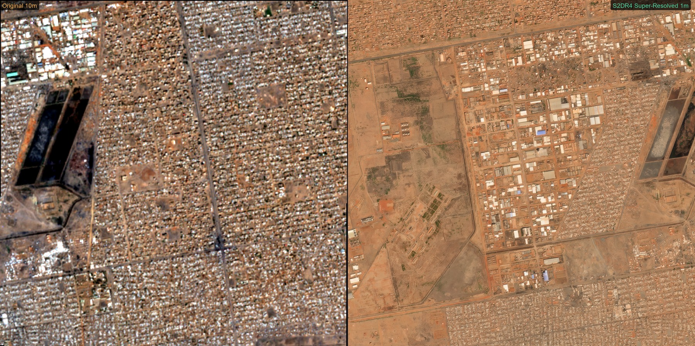
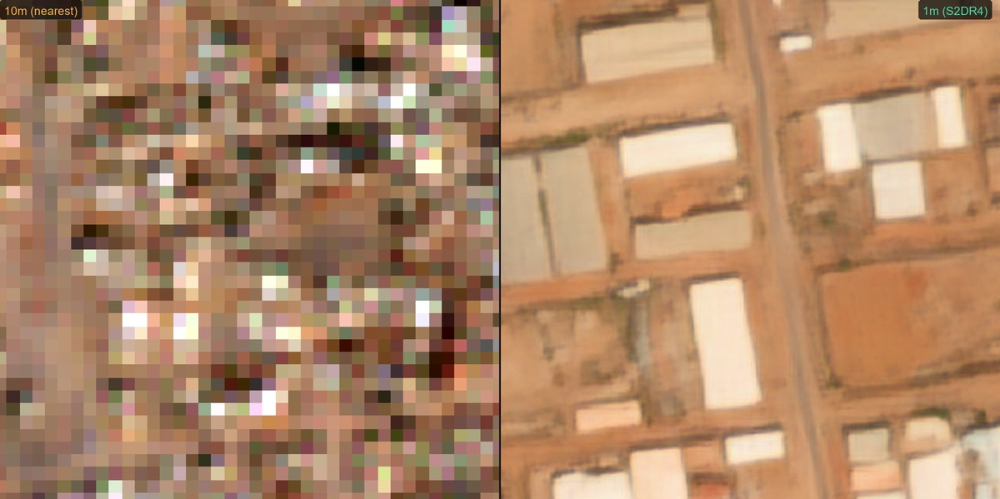
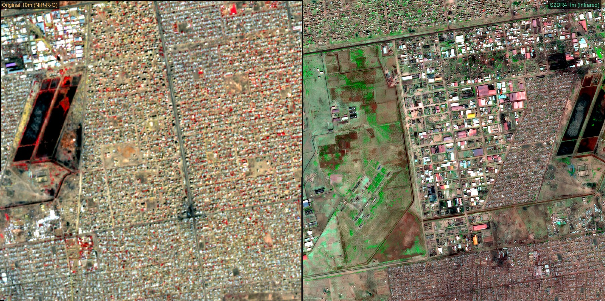
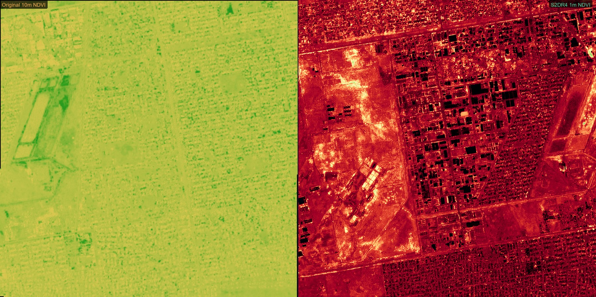

<div align="center">

# S2DR4-Khartoum-SuperRes

**Sentinel-2 Deep Super-Resolution: 10 m &rarr; 1 m/pixel over Khartoum, Sudan**

[](https://python.org)
[](https://colab.research.google.com)
[](https://earthengine.google.com)
[](LICENSE)

</div>

---



<p align="center"><i>Left: Original Sentinel-2 (10 m/px) &nbsp;|&nbsp; Right: S2DR4 Super-Resolved (1 m/px) &mdash; Khartoum, Sudan</i></p>

## Overview

This repository demonstrates a complete **10x super-resolution** workflow for Sentinel-2 satellite imagery using [Gamma Earth S2DR4](https://medium.com/@ya_71389/c71a601a2253) (Sentinel-2 Deep Resolution 4.0). A deep learning model transforms standard 10 m/pixel multispectral data into 1 m/pixel products &mdash; resolving individual buildings, roads, and vegetation patches that are invisible at native resolution.

**Area of interest:** 4 &times; 4 km centered on Khartoum, Sudan

## Results Gallery

### Zoom: 10 m vs 1 m



<p align="center"><i>400 &times; 400 m crop &mdash; pixelated 10 m input vs sharp 1 m output. Individual structures become clearly distinguishable.</i></p>

### False Color (Infrared)



<p align="center"><i>NIR-R-G composite reveals vegetation health and land cover at dramatically higher spatial detail.</i></p>

### NDVI (Vegetation Index)



<p align="center"><i>Normalized Difference Vegetation Index &mdash; fine-grained vegetation mapping at 1 m resolution.</i></p>

## Output Products

S2DR4 generates four GeoTIFF products at **1 m/pixel** resolution:

| Product | Bands | Description |
|---------|-------|-------------|
| `_MS.tif` | 10 | Full multispectral (B2, B3, B4, B5, B6, B7, B8, B8A, B11, B12) |
| `_TCI.tif` | 3 | True Color RGB |
| `_IRP.tif` | 3 | Infrared pseudo-color |
| `_NDVI.tif` | 3 | Colorized vegetation index |

## Workflow

```
 Google Earth Engine          Google Colab (T4 GPU)         Local (Python)
┌──────────────────┐      ┌──────────────────────┐     ┌───────────────────┐
│  Download S2 L2A │ ───> │  S2DR4 Inference     │ ──> │  Compare & Inspect│
│  10m GeoTIFFs    │      │  10m → 1m (10x SR)   │     │  Interactive HTML  │
└──────────────────┘      └──────────────────────┘     └───────────────────┘
  gee/sentinel2_           notebooks/S2DR4_              scripts/
  download.js              Khartoum_SuperRes.ipynb       create_comparison.py
```

### Step 1 &mdash; Download Sentinel-2 Data

Copy [`gee/sentinel2_download.js`](gee/sentinel2_download.js) into the [GEE Code Editor](https://code.earthengine.google.com), set your location and date range, then export to Google Drive.

### Step 2 &mdash; Run Super-Resolution

Open [`notebooks/S2DR4_Khartoum_SuperRes.ipynb`](notebooks/S2DR4_Khartoum_SuperRes.ipynb) in Google Colab with a **T4 GPU** runtime and run all cells. Output GeoTIFFs are saved directly to Google Drive.

### Step 3 &mdash; Compare & Analyze

```bash
# Interactive HTML viewer with drag-slider (10m vs 1m)
python scripts/create_comparison.py

# CLI statistics and band-by-band comparison
python scripts/compare_results.py

# Inspect raw GeoTIFF metadata and pixel statistics
python scripts/inspect_data.py
```

## Prerequisites

| Requirement | Purpose |
|-------------|---------|
| [Google Earth Engine](https://earthengine.google.com/) account | Sentinel-2 data download |
| [Google Colab](https://colab.research.google.com/) (free T4 GPU) | S2DR4 inference |
| Python 3.10+ | Local comparison scripts |
| `rasterio`, `numpy`, `Pillow` | GeoTIFF processing |

## Repository Structure

```
S2DR4-Khartoum-SuperRes/
├── README.md
├── LICENSE
├── .gitignore
├── notebooks/
│   ├── S2DR4_Khartoum_SuperRes.ipynb    # Main Colab inference notebook
│   └── S2DR4T_infer_20260126.ipynb      # Reference notebook
├── scripts/
│   ├── run_s2dr4.py                     # WSL2 local inference runner
│   ├── create_comparison.py             # Interactive HTML comparison builder
│   ├── compare_results.py               # CLI data comparison
│   └── inspect_data.py                  # GeoTIFF metadata inspector
├── gee/
│   └── sentinel2_download.js            # Google Earth Engine export script
├── setup/
│   └── setup_wsl.sh                     # WSL2 environment setup
└── results/
    ├── hero_comparison.jpg              # Full-area RGB comparison
    ├── zoom_comparison.jpg              # Center crop zoom comparison
    ├── falsecolor_comparison.jpg        # NIR false color comparison
    ├── ndvi_comparison.jpg              # Vegetation index comparison
    └── result.png                       # Quick-reference comparison
```

## Credits

- **[S2DR4](https://medium.com/@ya_71389/c71a601a2253)** by Gamma Earth &mdash; Sentinel-2 Deep Resolution 4.0
- **[Copernicus Sentinel-2](https://sentinels.copernicus.eu/)** imagery &mdash; European Space Agency (ESA)
- **[Google Earth Engine](https://earthengine.google.com/)** &mdash; Planetary-scale geospatial analysis

## License

This project is licensed under the [MIT License](LICENSE).
