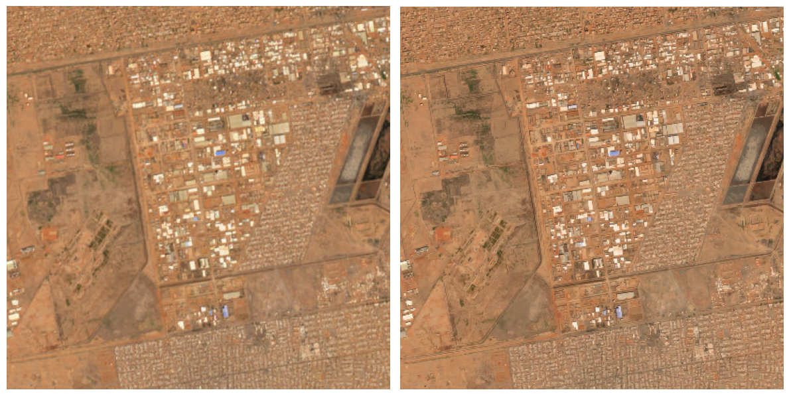

# S2DR4-Khartoum-SuperRes

Sentinel-2 super-resolution from **10 m to 1 m/pixel** over Khartoum, Sudan using [Gamma Earth S2DR4](https://medium.com/@ya_71389/c71a601a2253).



## What This Does

S2DR4 (Sentinel-2 Deep Resolution 4.0) applies deep-learning super-resolution to Sentinel-2 L2A imagery, producing 1 m/pixel outputs across 10 spectral bands, true-color RGB, NDVI, and infrared pseudo-color products.

This repository contains the full workflow for a **4 x 4 km area** centered on Khartoum:

1. **Download** Sentinel-2 data via Google Earth Engine
2. **Run inference** on Google Colab (T4 GPU) or locally via WSL2
3. **Compare** original 10 m vs super-resolved 1 m results with an interactive HTML viewer

## Output Products (1 m resolution)

| File | Description |
|------|-------------|
| `_MS.tif` | 10-band multispectral (B2, B3, B4, B5, B6, B7, B8, B8A, B11, B12) |
| `_TCI.tif` | True color RGB |
| `_NDVI.tif` | Vegetation index (colorized) |
| `_IRP.tif` | Infrared pseudo-color |

## Prerequisites

- **Google Earth Engine** account for downloading Sentinel-2 data
- **Google Colab** with T4 GPU runtime (free tier works)
- Python 3.10+ with `rasterio`, `numpy`, `Pillow` for local comparison scripts

## Quick Start

### 1. Download Sentinel-2 Data

Copy `gee/sentinel2_download.js` into the [GEE Code Editor](https://code.earthengine.google.com), configure the location/date, and export to Google Drive.

### 2. Run Super-Resolution

Open `notebooks/S2DR4_Khartoum_SuperRes.ipynb` in Google Colab, connect a T4 GPU runtime, and run all cells. Results are saved to Google Drive.

### 3. Compare Results

```bash
# Interactive HTML comparison (drag slider between 10m and 1m)
python scripts/create_comparison.py

# CLI data comparison
python scripts/compare_results.py

# Inspect raw GeoTIFF metadata
python scripts/inspect_data.py
```

## Repository Structure

```
S2DR4-Khartoum-SuperRes/
├── README.md
├── LICENSE
├── .gitignore
├── notebooks/
│   ├── S2DR4_Khartoum_SuperRes.ipynb   # Colab inference notebook
│   └── S2DR4T_infer_20260126.ipynb     # Reference notebook
├── scripts/
│   ├── run_s2dr4.py                    # WSL2 local inference runner
│   ├── create_comparison.py            # Interactive HTML comparison
│   ├── compare_results.py              # CLI data comparison
│   └── inspect_data.py                 # GeoTIFF inspector
├── gee/
│   └── sentinel2_download.js           # Google Earth Engine export script
├── setup/
│   └── setup_wsl.sh                    # WSL2 environment setup
└── results/
    └── result.png                      # Sample comparison image
```

## Credits

- **[S2DR4](https://medium.com/@ya_71389/c71a601a2253)** by Gamma Earth -- Sentinel-2 Deep Resolution 4.0
- **[Copernicus Sentinel-2](https://sentinels.copernicus.eu/)** -- Source imagery (ESA)
- **[Google Earth Engine](https://earthengine.google.com/)** -- Data access and preprocessing

## License

[MIT](LICENSE)
